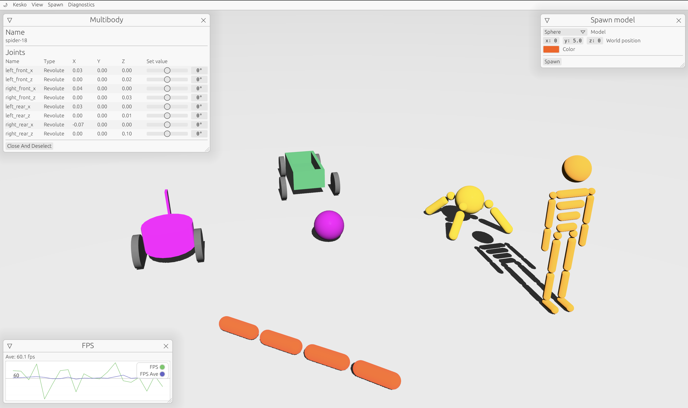
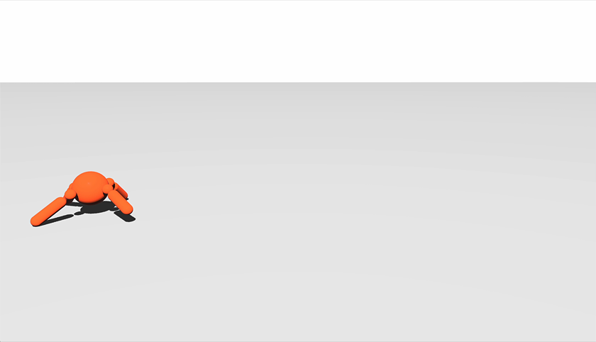

<!-- Improved compatibility of back to top link: See: https://github.com/othneildrew/Best-README-Template/pull/73 -->
<a name="readme-top"></a>


<!-- PROJECT SHIELDS -->

<!-- PROJECT LOGO -->
<br />
<div align="center">
  <a href="https://github.com/wynss/kesko">
    
  </a>

  <h3 align="center">Kesko</h3>


  <p align="center">
    Experimental robotics simulator written in Rust.
    <br />
    <br />
    
    
    
    
    <br />
    <br />
    <a href="#about-the-project">About The Project</a> |
    <a href="#getting-started">Getting Started</a> |
    <a href="#pykesko">PyKesko</a> |
    <a href="#demo">Demo</a> |
    <a href="#acknowledgments">Acknowledgments</a>
  </p>
</div>

<!-- ABOUT THE PROJECT -->
## About The Project


<br />
Kesko is pre-release and in its infancy, quite far from useful (but perhaps a bit fun to play around with). Currently it's more an exploration in Rust and what is currently possible within its open-source community. But, as time goes on the goal is to create a modern robotics simulator that fulfills

* Easiest simulator to get started with machine learning and robotics
* Best simulator for procedurally generate new environments for training
* Free and open-source
* Good looking!

<p align="right">(<a href="#readme-top">back to top</a>)</p>


<!-- GETTING STARTED -->
## Getting Started
Kesko in not yet available on [crates.io](https://crates.io/) but you can clone the repo and run locally.
### Prerequisites
 
 Make sure you have [Rust](https://www.rust-lang.org/learn/get-started) installed.

### Installation

1. Clone the repo
   ```bash
   git clone https://github.com/wynss/kesko.git

   ```
2. Build and run the demo example
   ```bash
   cd kesko/kesko
   cargo run --bin kesko_demo --release
   ```

<p align="right">(<a href="#readme-top">back to top</a>)</p>

## PyKesko
Kesko will have a python API built with [PyO3](https://github.com/PyO3/pyo3) making it easy to integrate with popular deep/reinforcement learning frameworks such as [PyTorch](https://pytorch.org/), [Tensorflow](https://www.tensorflow.org/). It will also integrate well with [Gymnasium](https://github.com/Farama-Foundation/Gymnasium) making it easy to use high quality implementation of RL algorithms like [Stable Baselines3](https://stable-baselines3.readthedocs.io/en/master/). Below is an example of a four legged model that has been trained to walk using Kesko's Gymnasium integration. The algorithm used was an implementation of Proximal Policy Optimization (PPO) from the Stable Baselines3 library.


### Pre-release version
There is a pre-release version available of PyKesko, read more about how to use it [here](https://github.com/wynss/kesko/blob/main/pykesko).

<p align="right">(<a href="#readme-top">back to top</a>)</p>

## Demo

Thanks to WebAssembly support Kesko can be run in the browser, try it here [Kesko Demo](https://toniaxelsson.com/projects/kesko)

<p align="right">(<a href="#readme-top">back to top</a>)</p>


<!-- CONTRIBUTING -->
## Contributing

If you have a suggestion that would make this better, please fork the repo and create a pull request. You can also simply open an issue with the tag "enhancement".

1. Fork the Project
2. Create your Feature Branch (`git checkout -b feature/AmazingFeature`)
3. Commit your Changes (`git commit -m 'Add some AmazingFeature'`)
4. Push to the Branch (`git push origin feature/AmazingFeature`)
5. Open a Pull Request

<p align="right">(<a href="#readme-top">back to top</a>)</p>


<!-- LICENSE -->
## License

Distributed under the MIT License. See `LICENSE` for more information.

<p align="right">(<a href="#readme-top">back to top</a>)</p>


<!-- CONTACT -->
## Contact

Toni Axelsson - [@toniaxelsson](https://twitter.com/toniaxelsson)

<p align="right">(<a href="#readme-top">back to top</a>)</p>


<!-- ACKNOWLEDGMENTS -->
## Acknowledgments

Many thanks to the awesome people building

* [Bevy](https://bevyengine.org)
* [Rapier](https://rapier.rs)

<p align="right">(<a href="#readme-top">back to top</a>)</p>


<!-- MARKDOWN LINKS & IMAGES -->
<!-- https://www.markdownguide.org/basic-syntax/#reference-style-links -->
[ci-shield]: https://img.shields.io/github/workflow/status/wynss/kesko/CI?style=flat-square
[product-screenshot]: media/kesko-1.png
